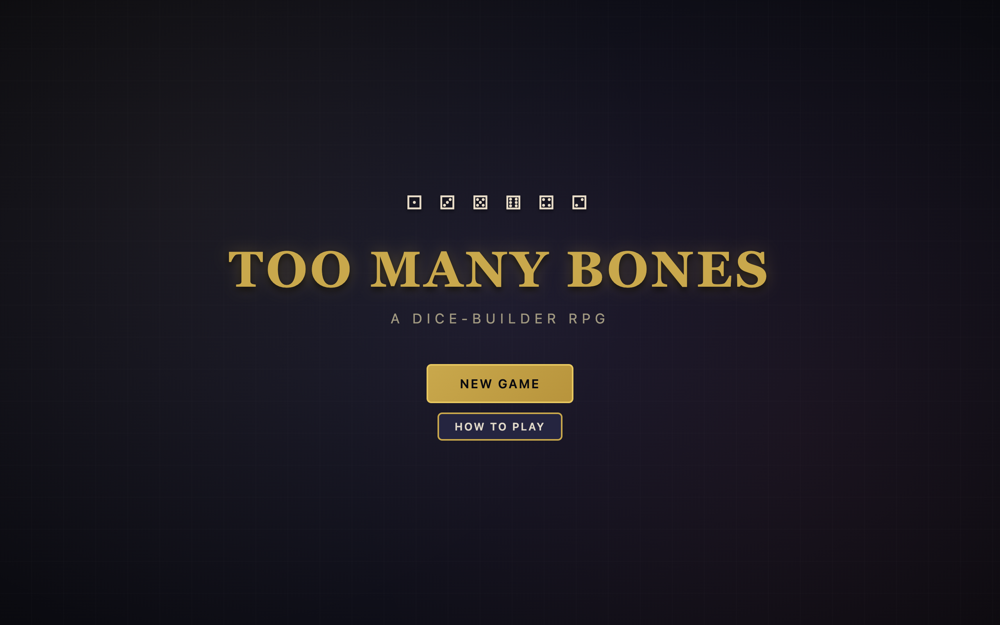
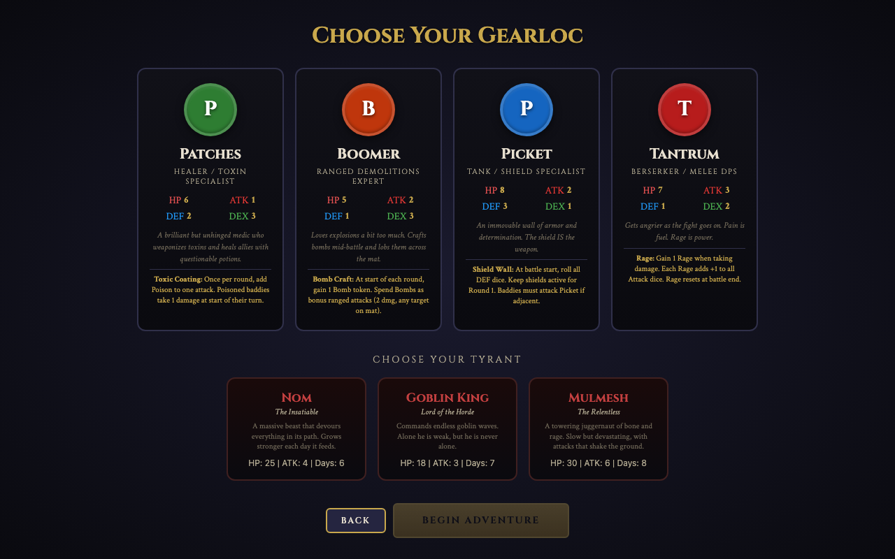
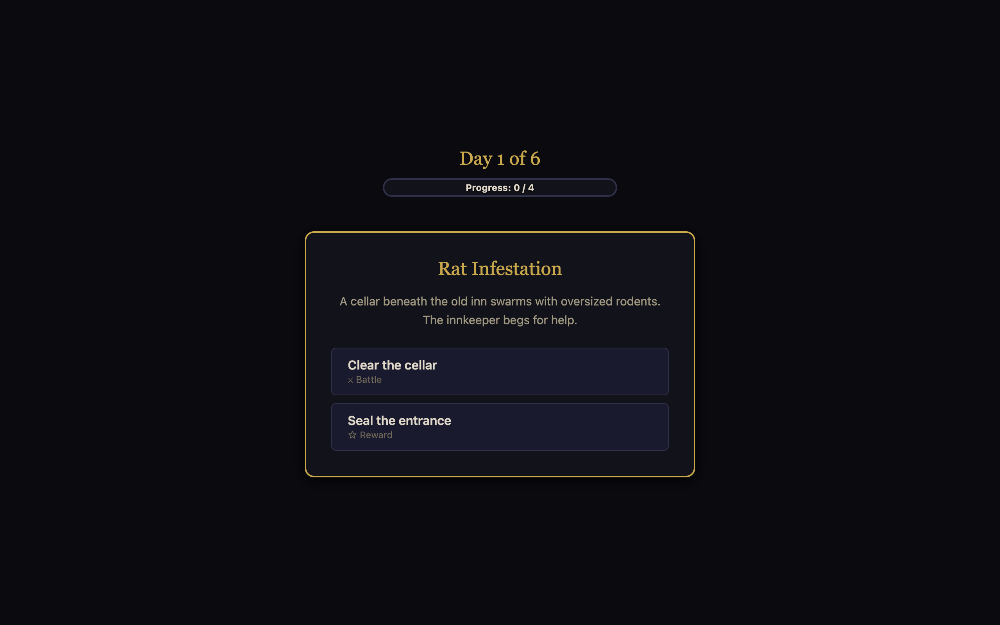
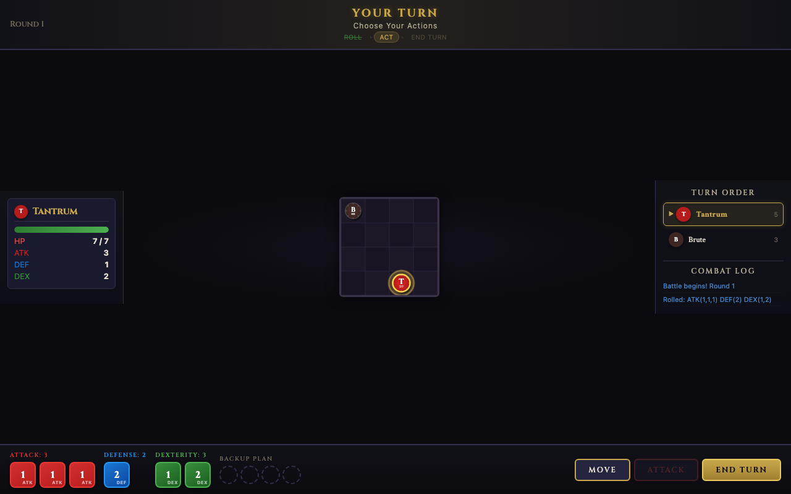

# Too Many Bones

[](https://mintlify.com/npow/too-many-bones)

> A digital dice-builder RPG inspired by the Chip Theory Games tabletop classic



## Screenshots

| Character Select | Encounter |
|:---:|:---:|
|  |  |

| Battle |
|:---:|
|  |

## About

Too Many Bones is a solo dice-builder RPG where you choose a Gearloc adventurer, face dangerous encounters over several days, and build up your dice pool and skills to defeat a powerful Tyrant boss.

Each day brings a new encounter with meaningful choices -- fight a goblin ambush or sneak through the ravine? Guard the merchant caravan or trade for loot? Every decision shapes your journey. Battles play out on a tactical 4x4 grid where you roll and allocate Attack, Defense, and Dexterity dice, manage status effects, and unleash powerful character-specific abilities.

The bones you roll aren't wasted -- they fill your Backup Plan, a unique safety net that triggers a special ability when full. Manage your resources carefully, train between battles, and arrive at the Tyrant's door strong enough to survive.

Based on the acclaimed tabletop game by Chip Theory Games. This is a fan-made digital adaptation for personal/educational use.

## Features

### Four Playable Gearlocs
- **Patches** -- Healer and toxin specialist. Poisons enemies over time and keeps herself alive with Med Packs. Her Pandemic Strike hits every baddie on the mat.
- **Boomer** -- Demolitions expert. Crafts bombs each round and lobs them anywhere on the grid. Frag Grenades hit clusters, Mega Bomb devastates everything.
- **Picket** -- Immovable tank. Raises a Shield Wall at the start of every battle and forces enemies to come through him. Shield Bash turns defense into offense.
- **Tantrum** -- Berserker. Gets stronger every time she takes damage. Rage stacks fuel devastating attacks, and Unstoppable lets her hit every enemy at once.

### Three Tyrant Bosses
- **Nom, the Insatiable** -- Devours your HP to heal himself while spawning minions each round
- **Goblin King, Lord of the Horde** -- Weak alone, but takes half damage while his endless goblin swarm lives
- **Mulmesh, the Relentless** -- Massive HP pool, Ground Slam hits everything on the mat, regenerating bone armor

### Tactical Grid Combat
- 4x4 battle mat with chip-style unit tokens
- Initiative-based turn order with dice rolling each round
- Attack, Defense, and Dexterity dice with meaningful allocation choices
- Bones fill your Backup Plan for clutch abilities
- 12 baddie types across three tiers (1pt / 5pt / 20pt) with unique behaviors
- Status effects: Poison, Stun, Burn
- Baddie queue and reinforcement waves

### Adventure System
- 18 unique encounters with branching choices
- Skill checks that test your stats against a difficulty class
- Day counter with progress tracking toward the Tyrant showdown
- Recovery phase: Rest to heal, Search for loot, or Scout for progress
- Training system: unlock skills from your Gearloc's tree or boost base stats

### Loot
- 15 items ranging from Health Potions and Whetstones to Troll Hide Armor and Venom Blades
- Consumables for clutch moments, equipment for lasting power
- Found through encounters, battle rewards, and searching

## How to Play

### Starting a Game
1. Click **New Game** on the title screen
2. Choose your **Gearloc** -- each has different stats and playstyle
3. Choose your **Tyrant** -- this determines how many days you have and how much progress you need
4. Click **Begin Adventure**

### Day Structure
Each day follows this flow:
1. **Encounter** -- Draw a card and pick one of two choices
2. **Battle** (if your choice triggers one) -- Fight baddies on the 4x4 grid
3. **Training** -- Spend Training Points to unlock skills or boost stats
4. **Recovery** -- Rest (full heal), Search (find loot), or Scout (gain progress)

### Combat
- **Roll Dice** at the start of your turn to get Attack, Defense, and Dexterity results
- **Move** using Dexterity points (click Move, then click a highlighted cell)
- **Attack** adjacent enemies (click Attack, then click a highlighted enemy)
- **Use Skills** from your unlocked skill tree for powerful effects
- **Bones** rolled go to your Backup Plan -- fill all 4 slots to trigger your Gearloc's special ability
- **End Turn** to let enemies act, then a new round begins
- Enemies move toward you and attack using AI pathfinding

### Winning
- Accumulate **Progress Points** through encounters, battles, and scouting
- Once you reach the required threshold, you can **face the Tyrant**
- Defeat the Tyrant to win. Run out of days without enough progress and the Tyrant overwhelms the land.

## Getting Started

### Play Locally
No build step, no dependencies. Just open the file:

```
git clone <repo-url>
open too_many_bones/index.html
```

Or double-click `index.html` in any modern browser.

### Debug
Open the browser console and run:
```js
window.render_game_to_text()
```
Returns a JSON snapshot of the full game state at any time.

## Roadmap

- [ ] Multiplayer (2-4 Gearlocs co-op)
- [ ] Additional Gearlocs (Gasket, Nugget, Ghillie, Tink)
- [ ] More Tyrants and encounter variety
- [ ] Animated dice with 3D tumble effect
- [ ] Persistent campaign progress across runs
- [ ] Mobile-optimized touch controls
- [ ] Accessibility improvements (keyboard navigation, screen reader support)

## Acknowledgments

**Too Many Bones** is designed by Josh and Adam Carlson and published by [Chip Theory Games](https://chiptheorygames.com/). This is an unofficial fan project for personal and educational use. All game design credit belongs to the original creators.

Built with vanilla HTML, CSS, JavaScript, and Canvas. No frameworks. Procedural audio via the Web Audio API.
